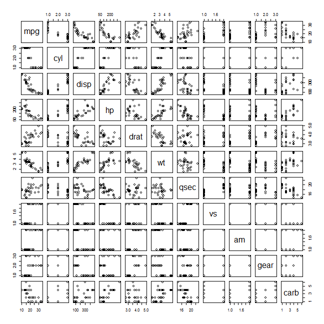
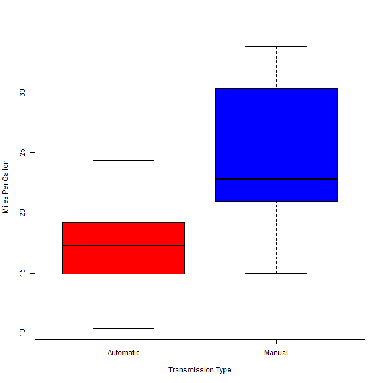

Automatic vs manual transmission
========================================================
Dobrogodin Evgenii, June 2015

Executive Summary
--------------------------------------------------------
Motor Trend magazine is interested in exploring the relationship between a set of variables and miles per gallon (MPG) in a data set of a collection of cars. They are particularly interested in the following two questions:

* Is an automatic or manual transmission better for MPG
* Quantify the MPG difference between automatic and manual transmissions

Using simple linear regression, we see that there is a signficant difference between the mean MPG for cars with automatic and manual transmission. As rule, manual transmissions has a significantly higher value of MPG than that for cars with automatic. This increase is approximately 1.8 MPG when switching from an automatic transmission to a manual one, with all else held constant.

Data Processing
--------------------------------------------------------
I will use *mtcras* data set. One could read the detailed info about data set by writting in console *?mtcars*. First, I will load the data and convert certain variables from *numeric* to *factors*.

```r
data(mtcars)
mtcars$cyl  <- factor(mtcars$cyl)
mtcars$vs   <- factor(mtcars$vs)
mtcars$gear <- factor(mtcars$gear)
mtcars$carb <- factor(mtcars$carb)
mtcars$am   <- factor(mtcars$am,labels=c("Automatic","Manual"))
```

Exploratory Analysis
--------------------------------------------------------
Firstly, I need to find variables that have strong correlation with variable of interest (*mpg*). We can plot the relationship between all the variables of the dataset for quick overview (see in the appendix).

Secondly, I interested how different transmissions effect on *mpg*. One can do it by looking at boxplot (appendix) that shows MPG by transmission type. Evidently, manual transmission have higher value of MPG.

Analysis
-------------------------------------------------------
Firstly, I will make the base model with only *am* as the predictor variable.

```r
base <- lm(mpg ~ am, data = mtcars)
```
Secondly I will build model which includes all variables as predictors of mpg. Then I will perform stepwise model selection in order to select significant predictors for the best model. *The step function* will use AIC (Akaike criterion) algorithm for comparing models. 

```r
lm1 <- lm(mpg ~ ., data = mtcars)
best <- step(lm1, direction = "both")
```

```r
summary(best)
```

```
## 
## Call:
## lm(formula = mpg ~ cyl + hp + wt + am, data = mtcars)
## 
## Residuals:
##     Min      1Q  Median      3Q     Max 
## -3.9387 -1.2560 -0.4013  1.1253  5.0513 
## 
## Coefficients:
##             Estimate Std. Error t value Pr(>|t|)    
## (Intercept) 33.70832    2.60489  12.940 7.73e-13 ***
## cyl6        -3.03134    1.40728  -2.154  0.04068 *  
## cyl8        -2.16368    2.28425  -0.947  0.35225    
## hp          -0.03211    0.01369  -2.345  0.02693 *  
## wt          -2.49683    0.88559  -2.819  0.00908 ** 
## amManual     1.80921    1.39630   1.296  0.20646    
## ---
## Signif. codes:  0 '***' 0.001 '**' 0.01 '*' 0.05 '.' 0.1 ' ' 1
## 
## Residual standard error: 2.41 on 26 degrees of freedom
## Multiple R-squared:  0.8659,	Adjusted R-squared:  0.8401 
## F-statistic: 33.57 on 5 and 26 DF,  p-value: 1.506e-10
```
The best model will use *cyl, hp, wt, am* variables for prediction. In this case, R-square will be *0.8659* which means that 87% of the variability is explained by the model and it is pretty much.

Now I can compare the base model with the best model.

```r
anova(base, best)
```

```
## Analysis of Variance Table
## 
## Model 1: mpg ~ am
## Model 2: mpg ~ cyl + hp + wt + am
##   Res.Df    RSS Df Sum of Sq      F    Pr(>F)    
## 1     30 720.90                                  
## 2     26 151.03  4    569.87 24.527 1.688e-08 ***
## ---
## Signif. codes:  0 '***' 0.001 '**' 0.01 '*' 0.05 '.' 0.1 ' ' 1
```
Looking at the above results, the p-value obtained is highly significant and I can reject the null hypothesis that the confounder variables *cyl, hp, wt, am* do not contribute to the accuracy of the model.

Residuals
--------------------------------------------------------
In this section, I will make residual plots of our regression model along with computation of regression diagnostics for chosen liner model. Examining the residuals could help in finding leverage points and outliers.


```r
par(mfrow=c(2, 2))
plot(best)
```

 
* The points in the _Residuals vs. Fitted plot_ are randomly scattered on the plot that verifies the independence condition.
* _The Normal Q-Q plot_ consists of the points which mostly fall on the line indicating that the residuals are normally distributed.
* _The Scale-Location plot_ consists of points scattered in a constant band pattern, indicating constant variance.
* Looking at _Residuals vs. Leverage_ one can see that there are some distinct points of interest (outliers or leverage points) in the top right of the plots that may indicate values of increased leverage of outliers. The data points with the most leverage in the fit can be found by looking at the _hat values_ and those that influence the model coefficients the most are given by the _dfbetas_ function.

```r
leverage <- hatvalues(best)
tail(sort(leverage),3)
```

```
##       Toyota Corona Lincoln Continental       Maserati Bora 
##           0.2777872           0.2936819           0.4713671
```

```r
influential <- dfbetas(best)
tail(sort(influential[,6]),3)
```

```
## Chrysler Imperial          Fiat 128     Toyota Corona 
##         0.3507458         0.4292043         0.7305402
```
Looking at the above results, one can see that analysis was correct, because presented cars are the same as mentioned in the residual plots.

Statistical Inference
--------------------------------------------------------
In this section, I will perform a *t-test* on the two subsets of mpg data: manual and automatic transmission assuming that the transmission data has a normal distribution and tests the null hypothesis that they come from the same distribution. Based on the t-test results, we reject the null hypothesis that the mpg distributions for manual and automatic transmissions are the same.

```r
t.test(mpg ~ am, data = mtcars)
```

```
## 
## 	Welch Two Sample t-test
## 
## data:  mpg by am
## t = -3.7671, df = 18.332, p-value = 0.001374
## alternative hypothesis: true difference in means is not equal to 0
## 95 percent confidence interval:
##  -11.280194  -3.209684
## sample estimates:
## mean in group Automatic    mean in group Manual 
##                17.14737                24.39231
```

Conclusions
--------------------------------------------------------
Based on the analysis done in this project:
* Cars with Manual transmission get 1.8 more miles per gallon compared to cars with Automatic transmission. 
* mpg will decrease by 2.5 for every 1000 lb increase in wt.
* mpg decreases negligibly (only 0.32) with every increase of 10 in hp.
* If number of cylinders increases from 4 to 6 and 8, mpg will decrease.

Appendix
--------------------------------------------------------
### Pairs plot for the dataset

```r
pairs(mpg ~ ., data = mtcars)
```

 

### Boxplot of MPG by transmission type

```r
boxplot(mpg ~ am, data = mtcars, col = (c("red","blue")), ylab = "Miles Per Gallon", xlab = "Transmission Type")
```

 
